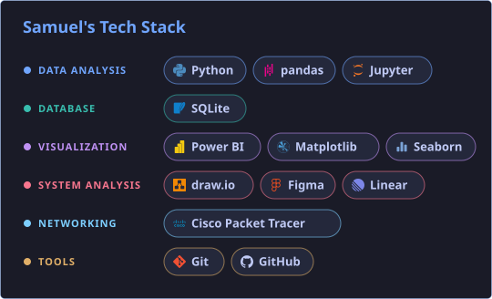

## 💫 About Me
🎓 Sistem Informasi, UPN Veteran Jakarta 
🔍 Fokus pada analitik pelanggan dan pasar: RFM, cohort, dan analisis saham 
📍 Jakarta

## 🌐 Socials

## 🚀 Projects

- **RFM & Cohort:** 14% customer menyumbang 51,5% revenue
- **Saham Pangan IDX:** lonjakan besar, tapi belum signifikan secara statistik (p > 0,05)

## 📈 Data Stats

## 💻 Tech Stack

