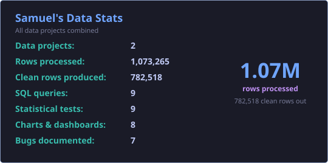

  Mahasiswa Sistem Informasi UPN Veteran Jakarta yang tertarik pada analitik data: 
  mengubah data mentah menjadi temuan yang bisa dipakai untuk mengambil keputusan.

📍 Jakarta

  
  
  

<h2 align="center">Data Stats</h2>

<h2 align="center">Tech Stack</h2>

<h3 align="center">Languages</h3>

<h3 align="center">Data Analysis</h3>

<h3 align="center">Visualization</h3>

<h3 align="center">Database</h3>

<h3 align="center">Data Collection</h3>

<h3 align="center">Tools</h3>

<h3 align="center">Networking</h3>

